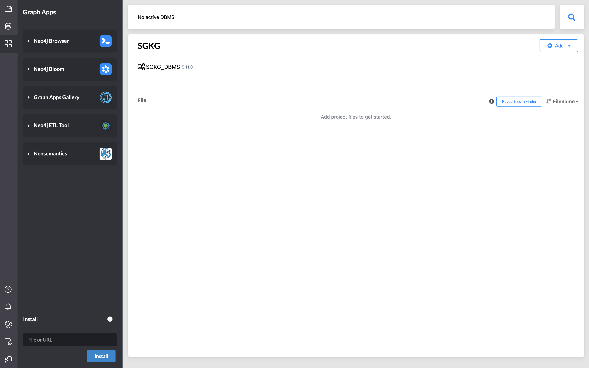
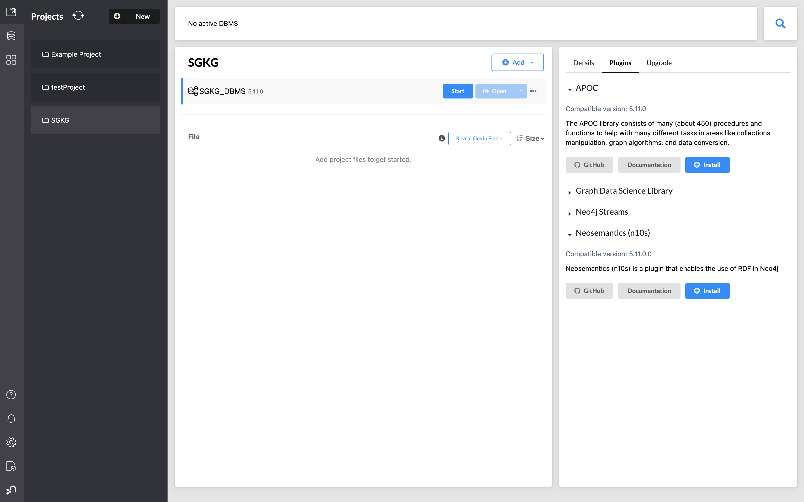
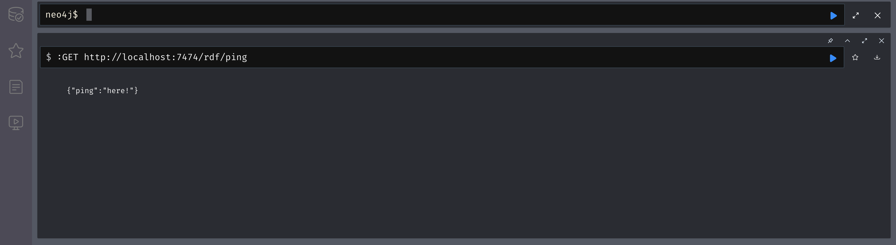
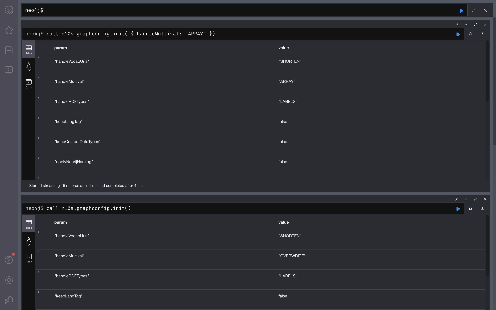
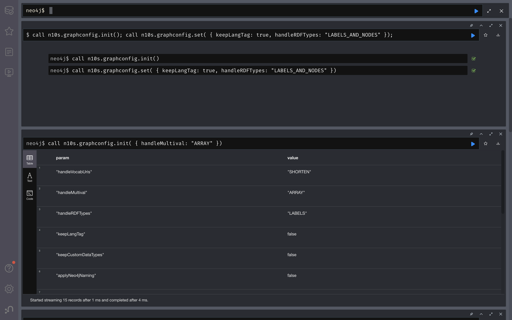
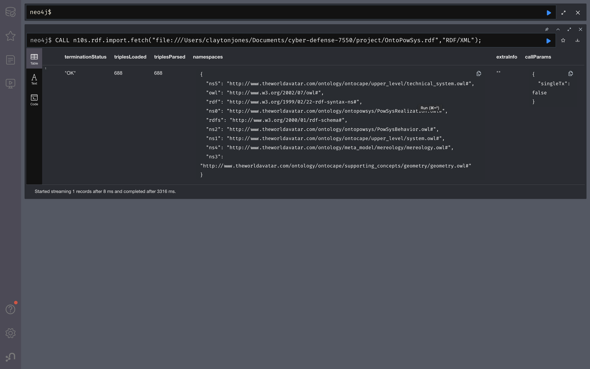

# Neo4j setup instructions for use with neosemantics (n10s), Ontologies, and Knowledge Graphs

## Installation

1. Install neo4j, create a project, and add a dbms to the project. See neo4j installation instructions below for help with this.

	Desktop
	https://neo4j.com/docs/desktop-manual/current/

	Server
	https://neo4j.com/download/?utm_source=google&utm_medium=PaidSearch&utm_campaign=GDB&utm_content=AMS-X-Conversion-GDB-Text&utm_term=download%20neo4j&gad_source=1&gclid=EAIaIQobChMI6duVsoLJggMVzvbICh0E4Q8AEAAYASAAEgIO1PD_BwE


### Neosemantics and APOC plugin installation

Select your database, (USE VERSION 5.11 for compatibility with both dbms and neosemantics plugin)
Install the neosemantics and APOC plugins. 
APOC is builtin, neosemsntics may be available in the graph apps sidebar tab, but can otherwise be installed by adding the jar file into the plugins directory. 
To access the plugins directory click on the three dots on the dbms, folder, plugins, and add the file.




(You will not have the install option for neosemantics yet. follow instructions below to install neosemantics plugin)

You want to have the http endpoint mounted on your DB server, so you'll need to 
add the following line to your config. 

1. Download the neosemantics jar file from the
   [releases area](https://github.com/neo4j-labs/neosemantics/releases)
   and copy it in the <NEO_HOME>/plugins directory of your Neo4j instance. 

2. Add the following line to your <NEO_HOME>/conf/neo4j.conf
      ```
      dbms.unmanaged_extension_classes=n10s.endpoint=/rdf
      ``` 
Add the fragment at the end of the file.
In the desktop you'll be able to do this by clicking on the 
three dots to the right hand side of your database and then select settings. 
For server installation use a terminal and vim.

3. Restart the server. 


### Verifying the installation

You can check that the installation went well by:
Running the cypher `SHOW PROCEDURES yield name, description, signature`. The list of procedures should include a number of them prefixed by **n10s**.

For testing the extension is mounted run `:GET http://localhost:7474/rdf/ping` on 
the neo4j browser. This should return the following message
```
{"ping":"here!"}
```




## Basic flow

####  0. Pre-req: Constraint Creation

``` 
CREATE CONSTRAINT n10s_unique_uri FOR (r: Resource)
REQUIRE r.uri IS
```

#### 1.  Creating a Graph Configuration
Before any RDF import operation a `GraphConfig` needs to be created. Here we define the way the RDF data is persisted in Neo4j. 
We'll find things like 

| Param        | Values           | Desc  |
| :------------- |:-------------|:-----|
| handleVocabUris     | "SHORTEN","KEEP","SHORTEN_STRICT","MAP"|  how namespaces are  handled |
| handleMultival     | "OVERWRITE","ARRAY"      | how multivalued properties are handled |
| handleRDFTypes | "LABELS","NODES","LABELS_AND_NODES"      |  how RDF datatypes are handled |
| multivalPropList | [ list of predicate uris ] |  |
| ...| ...|...|

Check the complete list in [the reference](https://neo4j.com/labs/neosemantics/4.0/reference/). 

You can create a graph config with all the defaults like this:
``` 
call n10s.graphconfig.init()
``` 

Or customize it by passing a map with your options:
``` 
call n10s.graphconfig.init( { handleMultival: "ARRAY", 
                              multivalPropList: ["http://voc1.com#pred1", "http://voc1.com#pred2"],
                              keepLangTag: true })
``` 



#### 2.  Importing RDF data

Once the Graph config is created we can import data from a url using `fetch`:

``` 
call n10s.rdf.import.fetch( "https://raw.githubusercontent.com/jbarrasa/neosemantics/3.5/docs/rdf/nsmntx.ttl",
                            "Turtle")
```
Or to use a local file:
```
CALL n10s.rdf.import.fetch("file:///Users/claytonjones/Documents/cyber-defense-7550/project/OntoPowSys.rdf","RDF/XML");
```



It is possible to pass some request specific parameters like headerParams, commitSize, languageFilter...
(also found [the reference](https://neo4j.com/labs/neosemantics/4.0/reference/))


#### 3.  Importing Ontologies, QuadRDF, etc

Same naming scheme applies...

```
call n10s.onto.import.fetch(...)
```

Use autocompletion to discover the different procedures.
